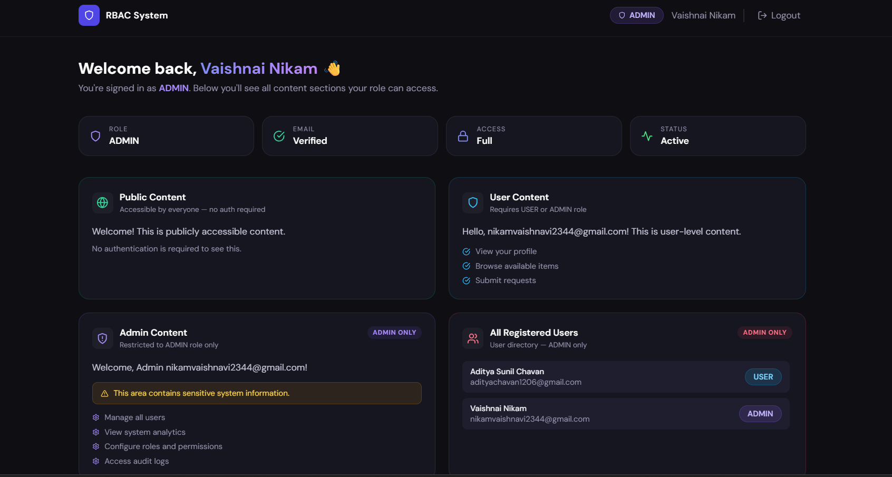
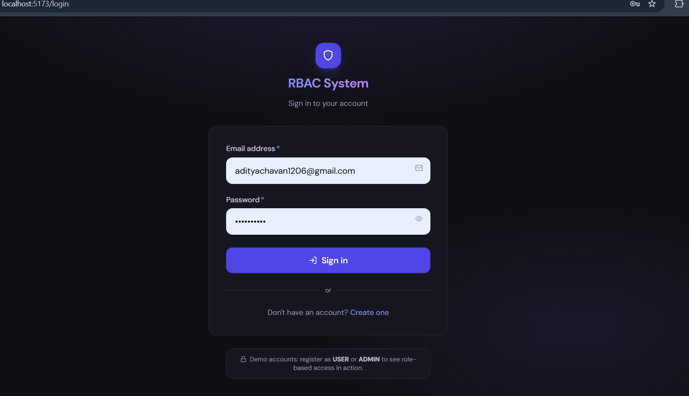

# 🔐 Full Stack Authentication & RBAC System

A production-quality full-stack application demonstrating **JWT-based authentication** and **Role-Based Access Control (RBAC)** using:

- **Backend** → Java 17 · Spring Boot 3 · Spring Security · JPA/Hibernate · MapStruct · Lombok · Swagger
- **Frontend** → React 18 · TypeScript · Vite · React Router · React Query · Axios · React Hook Form · TailwindCSS

---
# SCREENSHOTS : 


---


---
## 📁 Project Structure

```
rbac-app/
├── backend/                          # Spring Boot application
│   ├── pom.xml
│   └── src/main/
│       ├── java/com/rbac/
│       │   ├── RbacAuthApplication.java
│       │   ├── config/
│       │   │   ├── SecurityConfig.java       # Spring Security + CORS + JWT filter chain
│       │   │   └── OpenApiConfig.java        # Swagger/OpenAPI setup with JWT auth
│       │   ├── controller/
│       │   │   ├── AuthController.java       # POST /api/auth/register, /login, GET /me
│       │   │   └── ResourceController.java   # GET /api/public, /user, /admin
│       │   ├── dto/
│       │   │   ├── request/  RegisterRequest.java, LoginRequest.java
│       │   │   └── response/ AuthResponse.java, UserResponse.java, ApiResponse.java
│       │   ├── entity/       User.java, Role.java
│       │   ├── exception/    GlobalExceptionHandler.java, custom exceptions
│       │   ├── mapper/       UserMapper.java (MapStruct)
│       │   ├── repository/   UserRepository.java
│       │   ├── security/
│       │   │   ├── jwt/      JwtService.java, JwtAuthenticationFilter.java
│       │   │   └── service/  UserDetailsServiceImpl.java
│       │   └── service/      AuthService.java (interface) + impl/AuthServiceImpl.java
│       └── resources/
│           ├── application.properties            # H2 in-memory (default)
│           └── application-postgres.properties   # PostgreSQL (production)
│
└── frontend/                         # React + TypeScript application
    ├── index.html
    ├── vite.config.ts
    ├── tailwind.config.js
    └── src/
        ├── api/
        │   ├── axiosInstance.ts      # Axios with JWT interceptor + 401 handler
        │   ├── authApi.ts            # register, login, getMe
        │   └── resourceApi.ts        # public, user, admin content
        ├── components/
        │   ├── layout/Navbar.tsx     # Top bar with role badge + logout
        │   ├── ui/FormInput.tsx      # Reusable labelled input with error
        │   ├── ui/Alert.tsx          # Error / success banners
        │   ├── ui/Spinner.tsx        # Loading indicator
        │   └── ProtectedRoute.tsx    # Route guard (redirect if not authenticated)
        ├── hooks/useAuth.ts          # Auth mutations + logout
        ├── pages/
        │   ├── LoginPage.tsx         # Login form
        │   ├── RegisterPage.tsx      # Registration form with role selector
        │   └── DashboardPage.tsx     # Role-gated content cards
        ├── store/authStore.ts        # Zustand store persisted to localStorage
        ├── types/index.ts            # TypeScript interfaces
        ├── utils/errorUtils.ts       # Axios error message extractor
        ├── App.tsx                   # Route configuration
        └── main.tsx                  # React root + providers
```

---

## 🚀 Quick Start

### Prerequisites

| Tool | Version |
|------|---------|
| Java JDK | 17+ |
| Apache Maven | 3.8+ |
| Node.js | 18+ |
| npm | 9+ |

> **Database**: The app uses **H2 in-memory** by default — no database installation needed.
> Switch to PostgreSQL for persistence (see below).

---

### 1 — Clone / set up the project

```bash
# If cloning from a repo:
git clone <your-repo-url>
cd rbac-app

# Otherwise just navigate into the project root
cd rbac-app
```

---

### 2 — Start the Backend

```bash
cd backend

# Build and run with Maven
./mvnw spring-boot:run

# On Windows:
mvnw.cmd spring-boot:run
```

The backend starts on **http://localhost:8080**

Useful URLs once running:
| URL | Description |
|-----|-------------|
| http://localhost:8080/swagger-ui.html | Interactive API docs |
| http://localhost:8080/h2-console | H2 database console (dev only) |
| http://localhost:8080/v3/api-docs | Raw OpenAPI JSON |

**H2 Console settings** (if you want to inspect the DB):
- JDBC URL: `jdbc:h2:mem:rbacdb`
- Username: `sa`
- Password: *(leave blank)*

---

### 3 — Start the Frontend

```bash
# In a new terminal:
cd frontend

# Install dependencies
npm install

# Copy env file
cp .env.example .env

# Start the dev server
npm run dev
```

The frontend starts on **http://localhost:5173**

> Vite automatically proxies `/api/*` requests to `http://localhost:8080` (configured in `vite.config.ts`).

---

### 4 — Try it out

1. Open **http://localhost:5173**
2. Click **Create one** to register
3. Register as **USER** — explore the dashboard
4. Register again (new email) as **ADMIN** — see extra admin cards
5. Switch between accounts to see RBAC in action

---

## 🐘 Using PostgreSQL (Production)

1. Create a database:
```sql
CREATE DATABASE rbacdb;
```

2. Copy the postgres config as the active config:
```bash
cp backend/src/main/resources/application-postgres.properties \
   backend/src/main/resources/application.properties
```

3. Set environment variables (or edit the properties file):
```bash
export DB_USERNAME=postgres
export DB_PASSWORD=yourpassword
export JWT_SECRET=your64charHexSecretHere
```

4. Restart the backend.

---

## 🔑 Environment Variables

### Backend (`application.properties`)

| Property | Default | Description |
|----------|---------|-------------|
| `server.port` | `8080` | HTTP port |
| `app.jwt.secret` | *(hex string)* | 64-char hex JWT signing secret |
| `app.jwt.expiration-ms` | `86400000` | Token TTL in ms (24 hours) |
| `app.cors.allowed-origins` | `http://localhost:5173` | Comma-separated allowed origins |
| `spring.datasource.url` | H2 in-memory | JDBC URL |

### Frontend (`.env`)

| Variable | Default | Description |
|----------|---------|-------------|
| `VITE_API_BASE_URL` | `http://localhost:8080` | Backend base URL |

---

## 📡 API Documentation

### Base URL: `http://localhost:8080`

All responses use the envelope:
```json
{
  "success": true,
  "message": "Human-readable message",
  "data": { }
}
```

---

### 🔓 Auth Endpoints (`/api/auth`)

#### `POST /api/auth/register` — Register a new user

**Request Body:**
```json
{
  "name":     "Jane Doe",
  "email":    "jane@example.com",
  "password": "Secret@123",
  "role":     "USER"
}
```

**Validation rules:**
- `name`: 2–60 characters
- `email`: valid email format
- `password`: min 8 chars, must contain uppercase, lowercase, and digit
- `role`: `USER` or `ADMIN`

**201 Created:**
```json
{
  "success": true,
  "message": "User registered successfully",
  "data": {
    "token":     "eyJhbGciOiJIUzI1NiJ9...",
    "tokenType": "Bearer",
    "id":        1,
    "name":      "Jane Doe",
    "email":     "jane@example.com",
    "role":      "USER"
  }
}
```

**409 Conflict** (duplicate email):
```json
{ "success": false, "message": "Email already registered: jane@example.com" }
```

---

#### `POST /api/auth/login` — Authenticate

**Request Body:**
```json
{
  "email":    "jane@example.com",
  "password": "Secret@123"
}
```

**200 OK:**
```json
{
  "success": true,
  "message": "Login successful",
  "data": {
    "token":     "eyJhbGciOiJIUzI1NiJ9...",
    "tokenType": "Bearer",
    "id":        1,
    "name":      "Jane Doe",
    "email":     "jane@example.com",
    "role":      "USER"
  }
}
```

**401 Unauthorized** (wrong credentials):
```json
{ "success": false, "message": "Invalid email or password" }
```

---

#### `GET /api/auth/me` — Get current user profile

**Headers:** `Authorization: Bearer <token>`

**200 OK:**
```json
{
  "success": true,
  "message": "User profile retrieved",
  "data": {
    "id":        1,
    "name":      "Jane Doe",
    "email":     "jane@example.com",
    "role":      "USER",
    "createdAt": "2024-01-15T10:30:00"
  }
}
```

---

### 🌐 Resource Endpoints

#### `GET /api/public` — Public content

**Auth required:** ❌

**200 OK:**
```json
{
  "success": true,
  "message": "Public content retrieved",
  "data": {
    "message": "Welcome! This is publicly accessible content.",
    "info":    "No authentication is required to see this."
  }
}
```

---

#### `GET /api/user` — User-level content

**Auth required:** ✅ Role: `USER` or `ADMIN`

**Headers:** `Authorization: Bearer <token>`

**200 OK:**
```json
{
  "success": true,
  "message": "User content retrieved",
  "data": {
    "message":     "Hello, jane@example.com! This is user-level content.",
    "features":    ["View your profile", "Browse available items", "Submit requests"],
    "accessLevel": "USER"
  }
}
```

**403 Forbidden** (no token or wrong role):
```json
{ "success": false, "message": "Access denied: you don't have permission to access this resource" }
```

---

#### `GET /api/admin` — Admin content

**Auth required:** ✅ Role: `ADMIN` only

**Headers:** `Authorization: Bearer <token>`

**200 OK:**
```json
{
  "success": true,
  "message": "Admin content retrieved",
  "data": {
    "message":     "Welcome, Admin admin@example.com!",
    "permissions": ["Manage all users", "View system analytics", "Configure roles and permissions", "Access audit logs"],
    "accessLevel": "ADMIN",
    "warning":     "This area contains sensitive system information."
  }
}
```

---

#### `GET /api/admin/users` — List all users

**Auth required:** ✅ Role: `ADMIN` only

**200 OK:**
```json
{
  "success": true,
  "message": "Users retrieved",
  "data": [
    { "id": 1, "name": "Jane Doe",  "email": "jane@example.com",  "role": "USER",  "createdAt": "..." },
    { "id": 2, "name": "John Admin","email": "admin@example.com", "role": "ADMIN", "createdAt": "..." }
  ]
}
```

---

## 🔒 Security Architecture

```
Request
  │
  ▼
JwtAuthenticationFilter
  │  Reads "Authorization: Bearer <token>" header
  │  Extracts & validates JWT using JwtService
  │  Sets Authentication in SecurityContextHolder
  ▼
SecurityFilterChain
  │  /api/public    → permitAll()
  │  /api/user/**   → hasAnyRole("USER", "ADMIN")
  │  /api/admin/**  → hasRole("ADMIN")
  ▼
Controller (@PreAuthorize for method-level)
  │
  ▼
Service → Repository → Database
```

**JWT Payload (decoded):**
```json
{
  "sub": "jane@example.com",
  "iat": 1705318200,
  "exp": 1705404600
}
```

**Password storage:** BCrypt with strength 12 — passwords are never stored or logged in plaintext.

---


## 🏗️ Architecture Decisions

| Decision | Rationale |
|----------|-----------|
| **H2 default** | Zero setup — runs out of the box without installing a DB |
| **JWT stateless** | No server-side sessions; scales horizontally |
| **BCrypt strength 12** | Good balance of security and performance |
| **MapStruct** | Compile-time bean mapping — no reflection overhead |
| **Zustand + persist** | Lightweight global state with localStorage sync |
| **Zod on frontend** | Schema mirrors backend validation — consistent UX |
| **React Query** | Automatic caching, loading/error states, no boilerplate |
| **Axios interceptors** | Single place for token injection and 401 handling |

---

## 📸 Features Summary

- ✅ Register with name, email, password, and role (USER / ADMIN)
- ✅ Login — returns JWT token
- ✅ JWT stored in localStorage, attached to every API request
- ✅ Protected routes — redirect to login if not authenticated
- ✅ Role-based content cards on dashboard
- ✅ Admin sees all 4 cards (public, user, admin, user list)
- ✅ User sees 3 cards (public, user, locked admin)
- ✅ Logout clears token and redirects to login
- ✅ Password validation (length, uppercase, lowercase, digit)
- ✅ Loading and error states on all async operations
- ✅ Responsive dark UI
- ✅ Swagger UI with JWT auth support
- ✅ H2 console for local DB inspection
